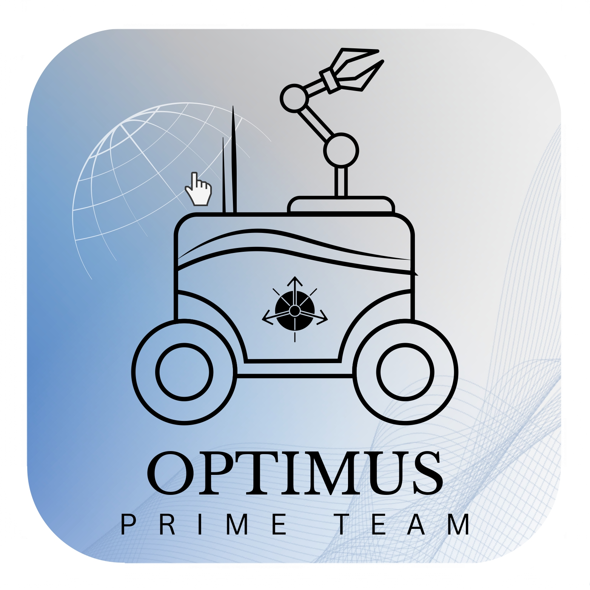

<!-- PROJECT LOGO -->
 

  

  <h3 align="center">Optimus Prime Team</h3>

  

    Projeto em Sistemas de Automação 2023/2024
     
    <a href="https://github.com/AMFS02/OptimusPT_PSA"><strong> Consultar Repositório »</strong></a>
     
     
  

<!-- TABLE OF CONTENTS -->

  
Table of Contents

  <ol>
    <li>
      <a href="#descriçao-do-projeto">Descrição do Projeto</a>
        </ul>
    </li>
    <li>
      <a href="#equipa">Equipa</a>
      </ul>
    </li>
    <li>
      <a href="#linguagens-e-plataformas">Linguagens e Plataformas</a></li>
      </ul>
    </li>
    <li>
      <a href="#objetivos">Objetivos</a>
      </ul>
    </li>
    <li>
      <a href="#endereços-ip">Endereços IP</a>
      </ul>
    </li>
    <li>
      <a href="#demonstração">Demonstração</a>
      </ul>
    </li>
    <li>
      <a href="#relatório">Relatório de Projeto</a>

<!-- Descrição do Projeto-->
## Descrição do Projeto
  O Optimus, veículo desenvolvido no âmbito da Unidade Curricular (UC) de Projeto em Sistemas de Automação, enquadra-se na categoria de veículo autónomo, possuindo a capacidade de, sem intervenção humana, percorrer um circuito delimitado por uma linha branca, evitando, simultaneamente, obstáculos.\
    Adicionalmente, possui um modo de condução à distância, através do qual o utilizador consegue manipular a trajetória do carro e do manipulador que compõe o veículo. No robô encontra-se instalado um manipulador de três eixos, controlado manualmente e equipado com um eletroíman para recolha de objetos metálicos. O equipamento é capaz de identificar as linhas limitantes da pista de testes e efetuar a correção do percurso, bem como de contornar obstáculos. Adicionalmente, o veículo está ainda equipado com um sistema de captação e transmissão de vídeo, que efetua a partilha do campo de visão do veículo  em tempo real.\
  Relativamente ao manipulador, o mesmo consiste num sistema de três eixos, passível de ser operado por cinemática direta, através do controlo individual de cada servo, ou por cinemática
inversa, especificando apenas a posição final para a qual o manipulador se deve deslocar. Este manipulador tem a capacidade de transportar de objetos metálicos através de uma garra eletromagnética, bem como depositá-los no local adequado.\
  Neste sentido, este veículo possuí duas rodas motrizes, atuadas com dois motores DC codificados por encoders, e uma roda louca que confere estabilidade e amplitude de movimento. É ainda equipado
com sensorização auxiliar, uma câmera, um microcontrolador e um computador. A velocidade de comunicação entre estes componentes dita a capacidade de resposta atempada e movimentação adequada do
veículo, sendo por isso de extrema importância. Neste sentido opta-se por protocolos de comunicação que primem pela sua velocidade, sem prejuízo da estabilidade e consistência da conexão.\
  No que respeita o manipulador, este é composto por três servomotores de posição, com amplitude de 180 graus. A ativação e controlo dos mesmos é de utilização exclusivamente manual, auxiliada por uma câmara instalada na estrutura do manipulador. O acesso às imagens transmitidas por este dispositivo é disponibilizado em qualquer modo de operação. O controlo manual e visualização de dados são efetuados através de um website, acessível a qualquer dispositivo conectado à network criada pelo micro-controlador instalado no veículo. 
  

(<a href="#readme-top">back to top</a>)

<!-- Equipa -->
## Equipa 

* Alexandre Salgado, Nº 102553, E-mail: alexandre.salgado@ua.pt

- Lucas Lemos, Nº 102793, E-mail: lucas.lemos@ua.pt

+ Maria Rodrigues, Nº 102384, E-mail: rodrigues.mariaalves@ua.pt

* Vítor Silva, Nº 102878, E-mail: vitormtg02@ua.pt

> [!NOTE]
> Todos os membros pertencem à Turma P2, orientada pelo Prof. Dr. Jorge Augusto Fernandes Ferreira

> [!IMPORTANT]
> Grupo 5 

(<a href="#readme-top">back to top</a>)

<!-- Linguagens e Plataformas-->
## Linguagens e Plataformas

(<a href="#readme-top">back to top</a>)

<!-- Objetivos -->
## Objetivos
&#x2611; Projeto e Dimensionamento dos Sistemas de Atuação e Respetivos Drivers 

&#x2611; Projeto e Dimensionamento dos Sistemas de Controlo  

&#x2611; Projeto e Dimensionamento da Unidade de Alimentação de Energia 

&#x2611; Comando Remoto e Sistema de Comunicação sem Fios

&#x2611; Sistema de Navegação, Contorno de Obstáculos e Execução de Trajetórias

&#x2611; Projeto e Dimensionamento dos Sistemas de Sensorização Acesória 

&#x2611; Integração de um Sistema de LiveStreaming de Imagens para Auxílio da Navegação de Longa Distância

&#x2611; Modelo Cinemático do Manipulador e Posicionamento da Garra no Espaço 3D

(<a href="#readme-top">back to top</a>)

<!-- Endereços IP -->
## Endereços IP
* **Lattepanda**: 192.168.4.250
  
- **Arduino Uno Wifi**: 192.168.4.1
  
+ **Computador**: https:// 192.168.4.250
> [!WARNING]
> Este IP não corresponde ao endereço do computador mas ao endereço a partir do qual este vai aceder à página de monitorização e controlo

(<a href="#readme-top">back to top</a>)

<!-- Demonstração -->
## Demonstração

                                                                                                                                                href="#readme-top">back to top</a>)

<!-- Relatório -->
## Relatório
[Relatório de Projeto](Relatório__G2.2.pdf)

(<a href="#readme-top">back to top</a>)

 

  

